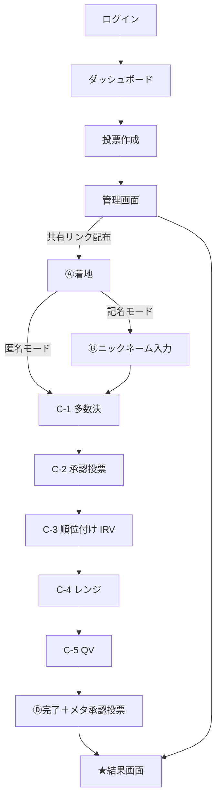

# みんなで決める — 実装仕様書

- **プロジェクト名**: みんなで決める (Minna-de Kimeru)
- **対象**: ワークショップ型投票アプリ
- **作成日**: 2026年4月21日
- **バージョン**: v1.0（初期リリース仕様）
- **読み手**: Claude Code（別チャットで実装を担当）

---

## 目次

1. [プロジェクト概要](#1-プロジェクト概要)
2. [技術スタック](#2-技術スタック)
3. [核心の設計思想](#3-核心の設計思想)
4. [画面構成](#4-画面構成)
5. [データベーススキーマ](#5-データベーススキーマ)
6. [5手法の詳細仕様](#6-5手法の詳細仕様)
7. [メタ承認投票の仕様](#7-メタ承認投票の仕様)
8. [認証・識別・プライバシー](#8-認証識別プライバシー)
9. [画像アップロード](#9-画像アップロード)
10. [レスポンシブ設計](#10-レスポンシブ設計)
11. [集計アルゴリズム疑似コード](#11-集計アルゴリズム疑似コード)
12. [主要な設計決定事項](#12-主要な設計決定事項)
13. [実装タスクリスト](#13-実装タスクリスト)
14. [環境変数・セットアップ](#14-環境変数セットアップ)
15. [テスト観点](#15-テスト観点)

---

## 1. プロジェクト概要

### 1.1 アプリ名と目的
「みんなで決める」は、ワークショップで**5つの異なる投票手法**を体験し、**同じ議題でも手法によって結果が変わる**ことを発見するためのWebアプリ。

### 1.2 核心の価値
**メタ民主主義の実装**。参加者は5手法で投票した後、「どの手法の結果を採用するか」自体を承認投票（メタ承認投票）で決める。「決め方自体を民主的に決める」という再帰構造により、結果の正当性が担保される。

### 1.3 想定ユースケース

| ユースケース | 特徴 |
|---|---|
| デザインコンペ（MUST） | 画像付き作品・10人以下 |
| 会議の議題選定 | テキストのみ |
| 予算配分の議論 | 金額・説明文 |
| アイデア選定 | アイデア集約 |

### 1.4 規模想定
- 作品数: 30以下（主に6〜10）
- 参加者数: 30以下（主に10以下）
- 1セッション時間: 15〜30分

---

## 2. 技術スタック

| 領域 | 技術 | 備考 |
|---|---|---|
| Framework | Next.js 15 (App Router) | TypeScript必須 |
| Styling | Tailwind CSS | v4以降 |
| UI Kit | shadcn/ui | 任意（コンポーネントベース） |
| Backend | Supabase | PostgreSQL + Auth + Storage + Realtime |
| Auth | Supabase Auth (Google OAuth) | 主催者のみ |
| Storage | Supabase Storage | 画像保存・1GBまで無料 |
| Deploy | Vercel | 自動CI/CD・Edge Functions対応 |
| PWA | next-pwa または serwist | オフライン対応は不要、ホーム画面追加のみ |
| Drag & Drop | `@dnd-kit/sortable` | 順位付け投票UIで使用 |

---

## 3. 核心の設計思想

### 3.1 5手法の順序（**固定**）

| 順 | 手法 | 粒度 |
|---|---|---|
| 1 | 多数決 | 1票（最も粗い） |
| 2 | 承認投票 | 0か1（複数可） |
| 3 | 順位付け投票（IRV） | 順序（離散） |
| 4 | レンジ投票 | 0〜5点（離散スコア） |
| 5 | クレジット配分（QV） | 25クレジット配分（連続・強度表現） |

**設計理由**: 粗い → 細かい、という教育的な学習曲線。参加者が自然に投票の表現力を増やしていく流れ。

### 3.2 メタ承認投票
5手法すべて投票した後、完了画面で「どの手法の結果を採用したいか」を承認投票（複数選択可）。**最多承認の手法の結果が採用**される。同点の場合は**並列表示**（1つに絞らない）。

### 3.3 汎用性の実現
UIはデザインコンペに最適化するが、**データ層は汎用設計**。`artworks` テーブルの画像URLは任意（nullable）なので、テキストのみの選択肢にも対応可能。

### 3.4 段階的実行フロー（参加者）
```
着地 → [ニックネーム入力（記名モードのみ）] → 投票プロセス → 完了
         ↓
  投票プロセス = 多数決 → 承認 → IRV → レンジ → QV
                  （各手法は独立画面・逆戻り不可・自動遷移）
```

---

## 4. 画面構成

### 4.1 画面一覧（9画面）

**主催者側（4画面）**

| # | 画面 | 役割 |
|---|---|---|
| 1 | ログイン | Google OAuth |
| 2 | ダッシュボード | セッション一覧・新規作成 |
| 3 | 投票作成 | フォーム・作品登録・共有リンク発行統合 |
| 4 | 状況確認・管理 | 進捗・結果プレビュー・結果公開切替・終了 |

**参加者側（4画面）**

| # | 画面 | 役割 |
|---|---|---|
| A | 着地画面 | 投票概要・開始ボタン |
| B | ニックネーム入力 | **記名モードのみ**表示 |
| C | 投票プロセス | 5手法ステップ・各手法で独立画面 |
| D | 完了画面 | メタ承認投票・自由記述・振り返り |

**共通（1画面）**

| # | 画面 | 役割 |
|---|---|---|
| ★ | 結果画面 | 採用手法・5手法比較・メタ投票結果・コメント |

### 4.2 画面遷移図



### 4.3 レイアウト原則
- **モバイルファースト**：スマホ画面（320〜375px幅）で最適
- **レスポンシブ対応**：`md:` `lg:` ブレークポイントでPC用レイアウト
- **縦スクロール前提**：固定位置は最低限（ヘッダー・FABなど）

---

## 5. データベーススキーマ

### 5.1 ER図（概念図）

```
organizers (1) ─── (N) voting_sessions
                         │
                         ├── (N) artworks
                         └── (N) participants
                                    │
                                    ├── (N) votes
                                    ├── (1) meta_votes
                                    └── (0/1) free_comments
```

### 5.2 DDL（PostgreSQL）

```sql
-- 主催者テーブル
CREATE TABLE organizers (
  id UUID PRIMARY KEY DEFAULT gen_random_uuid(),
  email TEXT NOT NULL UNIQUE,
  name TEXT NOT NULL,
  google_id TEXT UNIQUE,
  created_at TIMESTAMPTZ DEFAULT NOW()
);

-- 投票セッションテーブル
CREATE TABLE voting_sessions (
  id UUID PRIMARY KEY DEFAULT gen_random_uuid(),
  organizer_id UUID NOT NULL REFERENCES organizers(id) ON DELETE CASCADE,
  title TEXT NOT NULL,
  description TEXT,
  methods_config JSONB NOT NULL DEFAULT '{
    "enabled": ["majority", "approval", "irv", "range", "qv"],
    "order": ["majority", "approval", "irv", "range", "qv"],
    "qv_credits": 25,
    "range_max": 5
  }'::jsonb,
  participant_id_mode TEXT NOT NULL CHECK (participant_id_mode IN ('anonymous', 'nickname')) DEFAULT 'anonymous',
  result_visibility TEXT NOT NULL CHECK (result_visibility IN ('realtime', 'after_end')) DEFAULT 'after_end',
  share_token TEXT UNIQUE NOT NULL,
  status TEXT NOT NULL CHECK (status IN ('draft', 'active', 'closed')) DEFAULT 'draft',
  result_published BOOLEAN NOT NULL DEFAULT FALSE,
  created_at TIMESTAMPTZ DEFAULT NOW(),
  closed_at TIMESTAMPTZ
);

CREATE INDEX idx_voting_sessions_organizer ON voting_sessions(organizer_id);
CREATE INDEX idx_voting_sessions_share_token ON voting_sessions(share_token);

-- 作品テーブル
CREATE TABLE artworks (
  id UUID PRIMARY KEY DEFAULT gen_random_uuid(),
  session_id UUID NOT NULL REFERENCES voting_sessions(id) ON DELETE CASCADE,
  title TEXT NOT NULL,
  description TEXT,
  image_url TEXT,
  creator_name TEXT,
  display_order INTEGER NOT NULL DEFAULT 0,
  created_at TIMESTAMPTZ DEFAULT NOW()
);

CREATE INDEX idx_artworks_session ON artworks(session_id);

-- 参加者テーブル
CREATE TABLE participants (
  id UUID PRIMARY KEY DEFAULT gen_random_uuid(),
  session_id UUID NOT NULL REFERENCES voting_sessions(id) ON DELETE CASCADE,
  participant_number INTEGER NOT NULL,
  nickname TEXT,
  browser_id TEXT NOT NULL,
  joined_at TIMESTAMPTZ DEFAULT NOW(),
  completed_at TIMESTAMPTZ,
  UNIQUE (session_id, browser_id),
  UNIQUE (session_id, participant_number)
);

CREATE INDEX idx_participants_session ON participants(session_id);
CREATE INDEX idx_participants_browser ON participants(browser_id);

-- 投票データテーブル（手法ごと）
CREATE TABLE votes (
  id UUID PRIMARY KEY DEFAULT gen_random_uuid(),
  participant_id UUID NOT NULL REFERENCES participants(id) ON DELETE CASCADE,
  method TEXT NOT NULL CHECK (method IN ('majority', 'approval', 'irv', 'range', 'qv')),
  vote_data JSONB NOT NULL,
  submitted_at TIMESTAMPTZ DEFAULT NOW(),
  UNIQUE (participant_id, method)
);

CREATE INDEX idx_votes_participant ON votes(participant_id);
CREATE INDEX idx_votes_method ON votes(method);

-- メタ承認投票テーブル
CREATE TABLE meta_votes (
  id UUID PRIMARY KEY DEFAULT gen_random_uuid(),
  participant_id UUID NOT NULL REFERENCES participants(id) ON DELETE CASCADE UNIQUE,
  approved_methods JSONB NOT NULL DEFAULT '[]'::jsonb,
  none_selected BOOLEAN NOT NULL DEFAULT FALSE,
  submitted_at TIMESTAMPTZ DEFAULT NOW()
);

CREATE INDEX idx_meta_votes_participant ON meta_votes(participant_id);

-- 自由記述コメントテーブル
CREATE TABLE free_comments (
  id UUID PRIMARY KEY DEFAULT gen_random_uuid(),
  participant_id UUID NOT NULL REFERENCES participants(id) ON DELETE CASCADE UNIQUE,
  comment_text TEXT NOT NULL,
  submitted_at TIMESTAMPTZ DEFAULT NOW()
);

CREATE INDEX idx_free_comments_participant ON free_comments(participant_id);
```

### 5.3 TypeScript型定義

```typescript
// src/types/database.ts

export type VotingMethod = 'majority' | 'approval' | 'irv' | 'range' | 'qv';

export type SessionStatus = 'draft' | 'active' | 'closed';
export type ParticipantIdMode = 'anonymous' | 'nickname';
export type ResultVisibility = 'realtime' | 'after_end';

export interface Organizer {
  id: string;
  email: string;
  name: string;
  google_id: string | null;
  created_at: string;
}

export interface MethodsConfig {
  enabled: VotingMethod[];
  order: VotingMethod[];
  qv_credits: number;
  range_max: number;
}

export interface VotingSession {
  id: string;
  organizer_id: string;
  title: string;
  description: string | null;
  methods_config: MethodsConfig;
  participant_id_mode: ParticipantIdMode;
  result_visibility: ResultVisibility;
  share_token: string;
  status: SessionStatus;
  result_published: boolean;
  created_at: string;
  closed_at: string | null;
}

export interface Artwork {
  id: string;
  session_id: string;
  title: string;
  description: string | null;
  image_url: string | null;
  creator_name: string | null;
  display_order: number;
  created_at: string;
}

export interface Participant {
  id: string;
  session_id: string;
  participant_number: number;
  nickname: string | null;
  browser_id: string;
  joined_at: string;
  completed_at: string | null;
}

export type VoteData =
  | MajorityVoteData
  | ApprovalVoteData
  | IrvVoteData
  | RangeVoteData
  | QvVoteData;

export interface MajorityVoteData {
  artwork_id: string;
}

export interface ApprovalVoteData {
  artwork_ids: string[];
}

export interface IrvVoteData {
  rankings: Array<{ artwork_id: string; rank: number }>;
}

export interface RangeVoteData {
  scores: Record<string, number>; // { [artwork_id]: score }
}

export interface QvVoteData {
  credits: Record<string, number>; // { [artwork_id]: votes_count }
}

export interface Vote {
  id: string;
  participant_id: string;
  method: VotingMethod;
  vote_data: VoteData;
  submitted_at: string;
}

export interface MetaVote {
  id: string;
  participant_id: string;
  approved_methods: VotingMethod[];
  none_selected: boolean;
  submitted_at: string;
}

export interface FreeComment {
  id: string;
  participant_id: string;
  comment_text: string;
  submitted_at: string;
}
```

### 5.4 RLS（Row Level Security）ポリシー

```sql
-- organizers: 自分のレコードのみ閲覧・更新可
ALTER TABLE organizers ENABLE ROW LEVEL SECURITY;
CREATE POLICY "organizers_self_read" ON organizers
  FOR SELECT USING (auth.uid()::text = google_id);

-- voting_sessions: 主催者は自分のを編集、参加者は share_token で閲覧
ALTER TABLE voting_sessions ENABLE ROW LEVEL SECURITY;
CREATE POLICY "sessions_organizer_full" ON voting_sessions
  FOR ALL USING (
    organizer_id IN (SELECT id FROM organizers WHERE google_id = auth.uid()::text)
  );
CREATE POLICY "sessions_public_by_token" ON voting_sessions
  FOR SELECT USING (true); -- アプリケーション層で share_token チェック

-- artworks: セッション所有者は編集可、参加者は閲覧のみ
ALTER TABLE artworks ENABLE ROW LEVEL SECURITY;
CREATE POLICY "artworks_read_all" ON artworks FOR SELECT USING (true);
CREATE POLICY "artworks_write_organizer" ON artworks
  FOR ALL USING (
    session_id IN (
      SELECT id FROM voting_sessions WHERE organizer_id IN (
        SELECT id FROM organizers WHERE google_id = auth.uid()::text
      )
    )
  );

-- participants, votes, meta_votes, free_comments は
-- browser_id をクライアントから送り、サーバー側で整合性チェック
```

**重要**: 参加者の認証は `browser_id`（LocalStorageのUUID）で行うため、Supabase Authではなく**アプリケーション層でのチェック**を併用する。

---

## 6. 5手法の詳細仕様

### 6.1 ①多数決

**UI**: ラジオボタン（1つだけ選択）

**投票データ構造**:
```json
{
  "method": "majority",
  "vote_data": {
    "artwork_id": "uuid-of-selected-artwork"
  }
}
```

**集計**: 最多得票の作品を勝者。同点の場合、作品の `display_order` で優先。

---

### 6.2 ②承認投票

**UI**: チェックボックス（複数選択可）・「選択中：N件」を常時表示

**投票データ構造**:
```json
{
  "method": "approval",
  "vote_data": {
    "artwork_ids": ["uuid-a", "uuid-b", "uuid-c"]
  }
}
```

**集計**: 承認数最多の作品を勝者。

---

### 6.3 ③順位付け投票（IRV）

**UI**: ドラッグ&ドロップ（`@dnd-kit/sortable` 使用）。代替として上下矢印ボタンを併用。

**投票データ構造**:
```json
{
  "method": "irv",
  "vote_data": {
    "rankings": [
      { "artwork_id": "uuid-a", "rank": 1 },
      { "artwork_id": "uuid-b", "rank": 2 },
      { "artwork_id": "uuid-c", "rank": 3 }
    ]
  }
}
```

**集計（IRV方式）**: 各ラウンドで1位票をカウント。過半数がなければ最下位を除外し、その票を次位選好に振り替えて再集計。過半数が出るまで繰り返す。

---

### 6.4 ④レンジ投票

**UI**: 各作品に0〜5の6ボタン横並び。「採点済み：N/N件」を下部表示。

**投票データ構造**:
```json
{
  "method": "range",
  "vote_data": {
    "scores": {
      "uuid-a": 5,
      "uuid-b": 3,
      "uuid-c": 2
    }
  }
}
```

**集計**: 点数合計が最多の作品を勝者。未採点の作品は0点ではなく「無回答」として扱い、その作品の平均点を計算する際の分母から除外。

---

### 6.5 ⑤クレジット配分（QV）

**UI**: 各作品に +/- ボタン・残クレジット表示。クレジット不足時はボタンをグレーアウト。

**制約**:
- 総クレジット: 25
- コスト: `votes² credits`（1票=1, 2票=4, 3票=9, 4票=16, 5票=25）
- 最大5票まで（1作品に集中すると25クレジット全消費）

**投票データ構造**:
```json
{
  "method": "qv",
  "vote_data": {
    "credits": {
      "uuid-a": 4,
      "uuid-b": 3
    }
  }
}
```

**集計**: 票数合計が最多の作品を勝者。

**整合性チェック**（クライアント＆サーバー両方）:
```typescript
function validateQvVote(credits: Record<string, number>, maxCredits = 25): boolean {
  const totalCost = Object.values(credits).reduce((sum, v) => sum + v * v, 0);
  return totalCost <= maxCredits;
}
```

---

## 7. メタ承認投票の仕様

### 7.1 目的
5手法の投票がすべて完了した後、参加者が「どの手法の結果を採用したいか」を承認投票（複数選択可）で決定。最多承認の手法の結果が採用される。

### 7.2 UI
- 完了画面の中核要素
- 5手法＋「どれも望ましくない」の6選択肢
- 複数選択可（承認投票と同じ形式）
- 「全員の回答で採用手法が決定します（何個でも選択可）」と案内

### 7.3 投票データ構造
```json
{
  "approved_methods": ["approval", "range", "qv"],
  "none_selected": false
}
```

### 7.4 集計ロジック
```typescript
function determineAdoptedMethod(metaVotes: MetaVote[]): VotingMethod[] {
  const counts: Record<VotingMethod, number> = {
    majority: 0, approval: 0, irv: 0, range: 0, qv: 0
  };
  
  for (const mv of metaVotes) {
    if (mv.none_selected) continue;
    for (const method of mv.approved_methods) {
      counts[method]++;
    }
  }
  
  const maxCount = Math.max(...Object.values(counts));
  return (Object.keys(counts) as VotingMethod[])
    .filter(m => counts[m] === maxCount);
}
```

### 7.5 同点時の処理
- `determineAdoptedMethod` が複数手法を返した場合、**結果画面で並列表示**
- 1つに絞らない → 「民主的に決まらなかった事実」を可視化
- 参加者にはこの仕様を意識させず、結果画面のUIで自然に複数勝者が並ぶ

---

## 8. 認証・識別・プライバシー

### 8.1 主催者認証
Google OAuth via Supabase Auth。

```typescript
// src/lib/auth.ts
import { createClient } from '@supabase/supabase-js';

export async function signInWithGoogle() {
  const { data, error } = await supabase.auth.signInWithOAuth({
    provider: 'google',
    options: {
      redirectTo: `${window.location.origin}/auth/callback`
    }
  });
  return { data, error };
}
```

### 8.2 参加者識別
主催者がセッション作成時に以下の2モードから選択：

- **anonymous**（匿名モード）: ニックネーム入力なし・リンクタップ即投票
- **nickname**（記名モード）: ニックネーム入力画面あり

いずれも **browser_id**（LocalStorageに保存するUUID）で識別：

```typescript
// src/lib/participant.ts
const BROWSER_ID_KEY = 'minna_browser_id';

export function getBrowserId(): string {
  let id = localStorage.getItem(BROWSER_ID_KEY);
  if (!id) {
    id = crypto.randomUUID();
    localStorage.setItem(BROWSER_ID_KEY, id);
  }
  return id;
}
```

### 8.3 主催者画面での参加者表示
プライバシー保護のため、主催者画面では「参加者01」「参加者02」…と**連番で匿名表示**。nicknameが登録されていても、管理画面では番号ベースで表示（nicknameはデータとして保持するが、UIで前面に出さない運用も可）。

### 8.4 プライバシー原則
- 個別の投票データは主催者のみ閲覧可（`votes` テーブル）
- 参加者自身は自分の投票のみ閲覧可
- 結果画面では**集計後のデータのみ**公開
- 自由記述コメントは匿名（誰が書いたか表示しない）

---

## 9. 画像アップロード

### 9.1 保存場所
Supabase Storage バケット: `artworks/`

```
artworks/
  {session_id}/
    {artwork_id}.webp
```

### 9.2 クライアント側の処理

```typescript
// src/lib/image-upload.ts
export async function uploadArtworkImage(
  file: File,
  sessionId: string,
  artworkId: string
): Promise<string> {
  const compressed = await compressImage(file, {
    maxDimension: 1200,
    quality: 0.85,
    format: 'webp'
  });
  
  const path = `${sessionId}/${artworkId}.webp`;
  const { data, error } = await supabase.storage
    .from('artworks')
    .upload(path, compressed, { upsert: true });
  
  if (error) throw error;
  
  const { data: { publicUrl } } = supabase.storage
    .from('artworks')
    .getPublicUrl(path);
  
  return publicUrl;
}

async function compressImage(
  file: File,
  opts: { maxDimension: number; quality: number; format: 'webp' | 'jpeg' }
): Promise<Blob> {
  const img = await createImageBitmap(file);
  const scale = Math.min(opts.maxDimension / img.width, opts.maxDimension / img.height, 1);
  const canvas = document.createElement('canvas');
  canvas.width = img.width * scale;
  canvas.height = img.height * scale;
  const ctx = canvas.getContext('2d')!;
  ctx.drawImage(img, 0, 0, canvas.width, canvas.height);
  return new Promise((resolve) => {
    canvas.toBlob((blob) => resolve(blob!), `image/${opts.format}`, opts.quality);
  });
}
```

### 9.3 容量見積もり
- 1画像: 約200KB（1200px・WebP・quality 0.85）
- 30作品×30セッション: 30×30×0.2MB = 180MB
- Supabase無料枠1GBで約1,700作品まで

---

## 10. レスポンシブ設計

### 10.1 ブレークポイント（Tailwind標準）
- `sm:` ≥ 640px
- `md:` ≥ 768px
- `lg:` ≥ 1024px
- `xl:` ≥ 1280px

### 10.2 画面ごとのレイアウト戦略

| 画面 | モバイル | タブレット (md:) | PC (lg:) |
|---|---|---|---|
| 主催者ダッシュボード | 1列カード | 2列カード | 左サイドバー＋メイン |
| 主催者投票作成 | 縦スクロール | 2カラム（フォーム＋プレビュー） | 2カラム |
| 主催者管理画面 | 縦スクロール | 2カラム | 3カラム（QR＋進捗＋結果） |
| 参加者投票画面 | 1列作品 | 2列グリッド | 3列グリッド |
| 参加者完了画面 | 縦スクロール | 2カラム（振り返り＋メタ投票） | 2カラム |
| 結果画面 | 縦スクロール＋折りたたみ | 折りたたみ＋サイドメニュー | 5手法横並び比較 |

### 10.3 Tailwind実装例
```tsx
// 作品グリッド
<div className="grid grid-cols-1 md:grid-cols-2 lg:grid-cols-3 gap-4">
  {artworks.map(a => <ArtworkCard key={a.id} artwork={a} />)}
</div>

// 2カラムレイアウト（主催者管理画面）
<div className="flex flex-col md:flex-row gap-6">
  <aside className="md:w-64 flex-shrink-0">...</aside>
  <main className="flex-1">...</main>
</div>
```

---

## 11. 集計アルゴリズム疑似コード

### 11.1 多数決

```typescript
function calculateMajority(votes: MajorityVoteData[]): {
  counts: Record<string, number>;
  winner: string;
} {
  const counts: Record<string, number> = {};
  for (const v of votes) {
    counts[v.artwork_id] = (counts[v.artwork_id] || 0) + 1;
  }
  const winner = Object.entries(counts)
    .sort((a, b) => b[1] - a[1])[0][0];
  return { counts, winner };
}
```

### 11.2 承認投票

```typescript
function calculateApproval(votes: ApprovalVoteData[]): {
  counts: Record<string, number>;
  winner: string;
} {
  const counts: Record<string, number> = {};
  for (const v of votes) {
    for (const id of v.artwork_ids) {
      counts[id] = (counts[id] || 0) + 1;
    }
  }
  const winner = Object.entries(counts)
    .sort((a, b) => b[1] - a[1])[0][0];
  return { counts, winner };
}
```

### 11.3 IRV（順位付け）

```typescript
function calculateIrv(votes: IrvVoteData[], artworkIds: string[]): {
  rounds: Array<Record<string, number>>;
  winner: string;
  eliminated: string[];
} {
  const active = new Set(artworkIds);
  const eliminated: string[] = [];
  const rounds: Array<Record<string, number>> = [];
  
  while (active.size > 1) {
    const roundCounts: Record<string, number> = {};
    
    for (const v of votes) {
      const topChoice = v.rankings
        .sort((a, b) => a.rank - b.rank)
        .find(r => active.has(r.artwork_id));
      if (topChoice) {
        roundCounts[topChoice.artwork_id] = (roundCounts[topChoice.artwork_id] || 0) + 1;
      }
    }
    
    rounds.push(roundCounts);
    
    const totalVotes = Object.values(roundCounts).reduce((s, n) => s + n, 0);
    const majority = Math.floor(totalVotes / 2) + 1;
    const leader = Object.entries(roundCounts).sort((a, b) => b[1] - a[1])[0];
    
    if (leader[1] >= majority) {
      return { rounds, winner: leader[0], eliminated };
    }
    
    const loser = Object.entries(roundCounts).sort((a, b) => a[1] - b[1])[0][0];
    active.delete(loser);
    eliminated.push(loser);
  }
  
  return { rounds, winner: Array.from(active)[0], eliminated };
}
```

### 11.4 レンジ投票

```typescript
function calculateRange(votes: RangeVoteData[]): {
  totals: Record<string, number>;
  winner: string;
} {
  const totals: Record<string, number> = {};
  for (const v of votes) {
    for (const [id, score] of Object.entries(v.scores)) {
      totals[id] = (totals[id] || 0) + score;
    }
  }
  const winner = Object.entries(totals)
    .sort((a, b) => b[1] - a[1])[0][0];
  return { totals, winner };
}
```

### 11.5 QV（クレジット配分）

```typescript
function calculateQv(votes: QvVoteData[]): {
  totals: Record<string, number>;
  winner: string;
} {
  const totals: Record<string, number> = {};
  for (const v of votes) {
    for (const [id, count] of Object.entries(v.credits)) {
      totals[id] = (totals[id] || 0) + count;
    }
  }
  const winner = Object.entries(totals)
    .sort((a, b) => b[1] - a[1])[0][0];
  return { totals, winner };
}
```

### 11.6 メタ承認投票の集計（採用手法決定）

```typescript
function determineAdoptedMethods(metaVotes: MetaVote[]): {
  counts: Record<VotingMethod, number>;
  noneCount: number;
  adopted: VotingMethod[]; // 同点なら複数
} {
  const counts: Record<VotingMethod, number> = {
    majority: 0, approval: 0, irv: 0, range: 0, qv: 0
  };
  let noneCount = 0;
  
  for (const mv of metaVotes) {
    if (mv.none_selected) {
      noneCount++;
      continue;
    }
    for (const method of mv.approved_methods) {
      counts[method]++;
    }
  }
  
  const maxCount = Math.max(...Object.values(counts));
  const adopted = (Object.keys(counts) as VotingMethod[])
    .filter(m => counts[m] === maxCount && maxCount > 0);
  
  return { counts, noneCount, adopted };
}
```

---

## 12. 主要な設計決定事項

ワークショップ設計・UI設計フェーズで確定した論点のサマリ。

| 論点 | 決定 | 根拠 |
|---|---|---|
| 投票手法の実装数 | 5手法すべて | ワークショップの核心価値（比較体験） |
| 作品登録の権限 | 主催者のみ | 10人以下規模ではシンプルで十分 |
| 結果公開タイミング | 主催者が選べる | 即時/終了後の柔軟性 |
| 使う手法の選択 | 主催者が選べる（プリセット方式） | 1〜2時間のフル版と軽量版の使い分け |
| 手法の順序 | 固定（多数決→承認→IRV→レンジ→QV） | 粗い→細かい、教育的な流れ |
| 投票の送信タイミング | 逆戻り不可（各手法ごとに確定） | 独立判断の確保 |
| 手法間の遷移タイミング | 各自ペース＋自動遷移 | 技術的シンプル・小規模なら時間差少ない |
| 参加者の識別方式 | 主催者が選べる（匿名 or ニックネーム） | 汎用性を両立 |
| メタ承認投票の形式 | 承認投票（何個でも選択可） | 複数手法を同時評価可能・ワークショップとして美しい |
| 「どれも望ましくない」選択肢 | 含める | 無効票・反対意見の尊重 |
| 同点時の処理 | **並列表示**（1つに絞らない） | 民主的に決まらなかった事実を誠実に見せる |
| 結果画面の階層 | 総合＋折りたたみ展開 | 概要常時表示・詳細は必要時のみ |
| 参加者のデバイス | レスポンシブ両対応 | スマホ＋PC両方で使える |
| 主催者のデバイス | レスポンシブ両対応 | PC作業メイン＋スマホで進捗確認 |

---

## 13. 実装タスクリスト

推奨フェーズ分け。1〜2週間程度を見込む。

### フェーズ1: 基盤（2〜3日）
- [ ] Supabaseプロジェクト作成
- [ ] Google OAuth設定
- [ ] Next.js 15プロジェクト初期化（App Router）
- [ ] Tailwind CSS設定
- [ ] DBスキーマ作成（DDL実行）
- [ ] RLS設定
- [ ] TypeScript型定義ファイル作成
- [ ] PWA設定（manifest.json・service worker基礎）
- [ ] Vercelデプロイ（初期）

### フェーズ2: 主催者画面（3〜4日）
- [ ] ログイン画面（Google OAuth）
- [ ] ダッシュボード（セッション一覧・ステータス表示）
- [ ] 投票作成画面（フォーム・画像アップロード・プレビュー）
- [ ] 共有リンク発行機能（QRコード生成含む）
- [ ] 管理画面（進捗表示・結果公開切替・終了ボタン）

### フェーズ3: 参加者基礎画面（2〜3日）
- [ ] 着地画面（投票概要・開始ボタン）
- [ ] ニックネーム入力画面（記名モードのみ）
- [ ] browser_id 管理機構（LocalStorage）
- [ ] 途中離脱からの復帰機能

### フェーズ4: 5手法の投票UI（5〜7日）
- [ ] ①多数決UI（ラジオボタン）
- [ ] ②承認投票UI（チェックボックス・選択数表示）
- [ ] ③順位付けUI（@dnd-kit/sortable・矢印ボタン併用）
- [ ] ④レンジ投票UI（0〜5ボタン）
- [ ] ⑤QV UI（+/-ボタン・残クレジット表示・整合性チェック）
- [ ] プログレスバー・自動遷移制御
- [ ] 各手法の集計ロジック実装（11章の疑似コード）

### フェーズ5: 完了・結果画面（2〜3日）
- [ ] 完了画面（振り返り・メタ承認投票UI・自由記述）
- [ ] 結果画面・総合部分（採用手法ヒーロー・勝者表示）
- [ ] 5手法の結果一覧（折りたたみ展開）
- [ ] メタ承認投票結果の棒グラフ
- [ ] コメント一覧表示

### フェーズ6: 主催者向け機能強化（1〜2日）
- [ ] 参加者の投票詳細表示（番号ベース）
- [ ] CSV出力機能
- [ ] 結果の並列表示（同点時の挙動）

### フェーズ7: テスト・調整（2日）
- [ ] E2Eテスト（Playwright）
- [ ] モバイル実機テスト
- [ ] PC実機テスト
- [ ] アクセシビリティチェック
- [ ] デモワークショップ実施

---

## 14. 環境変数・セットアップ

### 14.1 .env.local

```bash
# Supabase
NEXT_PUBLIC_SUPABASE_URL=https://xxx.supabase.co
NEXT_PUBLIC_SUPABASE_ANON_KEY=xxx
SUPABASE_SERVICE_ROLE_KEY=xxx

# App
NEXT_PUBLIC_APP_URL=https://minna-de-kimeru.vercel.app
```

### 14.2 Supabase設定手順
1. Supabase にて新規プロジェクト作成
2. Authentication → Providers → Google を有効化
3. Google Cloud Console で OAuth クライアント作成（リダイレクトURIは Supabase から取得）
4. SQL Editor で 5.2 のDDL実行
5. Storage にて `artworks` バケット作成（公開バケット）

### 14.3 Google OAuth設定手順
1. Google Cloud Console → APIs & Services → Credentials
2. OAuth 2.0 クライアントID作成（種別: Web application）
3. 承認済みリダイレクトURI に `https://xxx.supabase.co/auth/v1/callback` を追加
4. クライアントID・シークレットを Supabase の Auth 設定に入力

### 14.4 Vercelデプロイ
1. GitHub連携
2. 環境変数を Vercel Dashboard に設定
3. `NEXT_PUBLIC_APP_URL` を本番URLに更新

---

## 15. テスト観点

### 15.1 機能テスト（各手法）
- [ ] 多数決：1つだけ選択できる・未選択では進めない
- [ ] 承認投票：0件選択で警告・選択数表示が正確
- [ ] 順位付け：全作品に順位がつく・ドラッグと矢印ボタン両方動作
- [ ] レンジ：0〜5の範囲外不可・未採点の扱い
- [ ] QV：総コスト25超過不可・クレジット不足時のボタン無効化

### 15.2 集計アルゴリズムの単体テスト
- [ ] 多数決：同点時の挙動
- [ ] IRV：最下位除外・票移譲が正しく動作
- [ ] IRV：過半数に達するラウンドで終了
- [ ] QV：二乗コスト計算
- [ ] メタ承認投票：同点時に複数手法を返す

### 15.3 E2Eシナリオテスト
- [ ] 主催者がセッション作成 → 共有リンク発行 → 参加者5人が投票 → 結果公開
- [ ] 途中離脱からの復帰（同じbrowser_idで続きから）
- [ ] 記名モード / 匿名モードの切替
- [ ] 結果の即時公開 / 終了後公開

### 15.4 プラットフォームテスト
- [ ] iPhone Safari / Android Chrome でPWA動作
- [ ] PC Chrome / Edge / Firefox
- [ ] タブレット（iPad Safari）
- [ ] レスポンシブブレークポイントの切替

### 15.5 負荷テスト
- [ ] 30人同時投票
- [ ] 30作品×3MB画像の一括アップロード

---

## 付録A: 参考資料

- ワークショップ企画書（別途）
- PPTXスライド `20260421_voting_workshop.pptx`
- ピクトグラム設計（5手法の比較図解）
- 本仕様書の元になった設計議論（Claudeプロジェクト内）

---

## 付録B: 将来の拡張候補

- 主催者コントロールモード（全員同期進行）
- 参加者も作品投稿可能モード
- 大規模セッション対応（100人以上）
- Polis風の熟議機能追加
- 結果のSNSシェア機能
- 多言語対応（英語・中国語など）

---

**以上**
